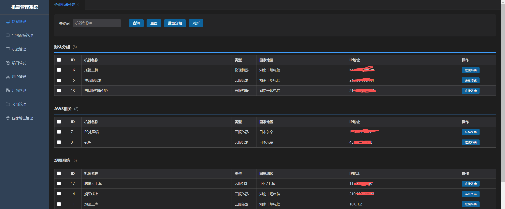
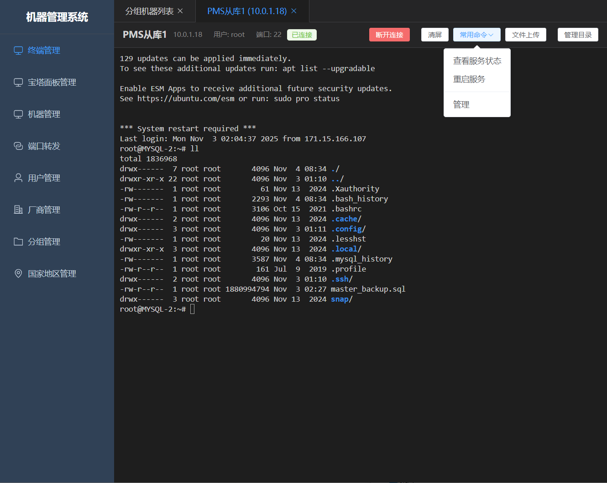
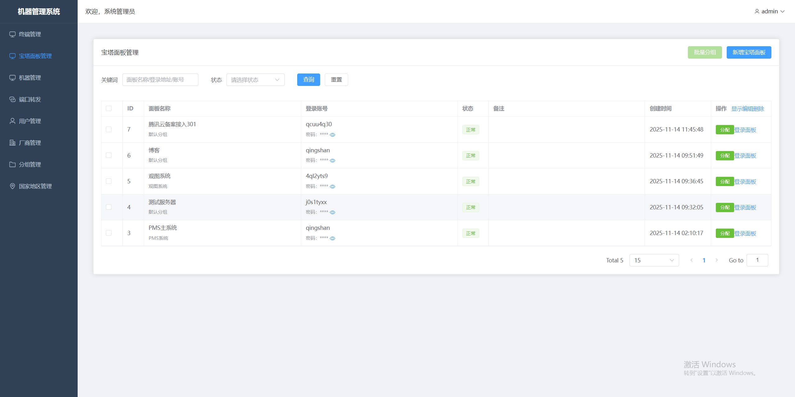
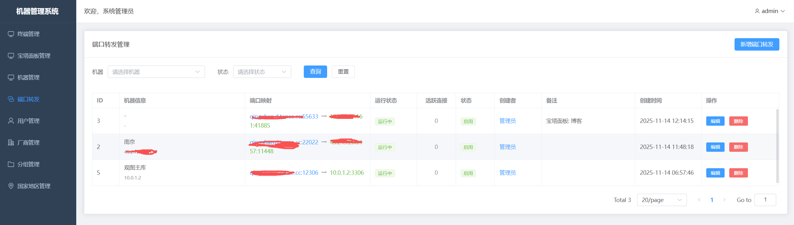

# WebClient 工具

## 简介

WebClient 是一款专业的云主机、宝塔面板和 SSH 服务统一管理平台。通过 Web 界面，您可以轻松管理多台服务器、宝塔面板和 SSH 连接，无需安装多个客户端工具，一个平台解决所有需求。

## 应用场景与优势

### 为什么选择 WebClient？

在当今云计算和远程运维的时代，服务器管理已成为开发者和运维人员的日常挑战。传统的管理方式往往需要安装多个客户端工具，记忆不同的登录凭证，切换不同的界面，效率低下且容易出错。WebClient 应运而生，为您提供一站式的服务器管理解决方案。

### 核心应用场景

**个人开发者**：如果您拥有多台云服务器，经常需要在不同平台间切换管理，WebClient 让您告别繁琐的工具切换。无论是阿里云、腾讯云还是 AWS，所有服务器信息集中展示，SSH 连接一键直达，宝塔面板快速访问。再也不用在浏览器标签页中迷失，再也不用记忆复杂的 IP 地址和端口号。

**小型团队**：团队协作中，服务器资源分配和权限管理是核心需求。WebClient 提供完善的用户权限体系，管理员可以灵活分配机器资源给不同成员，普通用户只能访问被授权的服务器，确保安全的同时提升协作效率。所有操作都有日志记录，便于追踪和审计。

**企业运维**：对于拥有大规模服务器集群的企业，WebClient 提供了集中化的运维管理平台。支持 MySQL 数据库，可以承载海量数据；支持分组管理，可以按项目、环境、地区等维度组织服务器；支持端口转发，轻松实现内网穿透和远程访问。无论是开发环境、测试环境还是生产环境，都能统一管理。

### 产品优势

**零学习成本**：基于 Web 的直观界面，无需安装任何客户端，打开浏览器即可使用。响应式设计完美适配 PC、平板和手机，随时随地管理您的服务器。

**安全可靠**：密码采用 AES-128-CBC 加密存储，JWT 身份认证机制，细粒度的权限控制，确保您的数据安全。支持 SQLite 和 MySQL 数据库，可根据需求灵活选择。

**高性能**：采用 Go 语言开发，具备出色的并发处理能力。WebSocket 实时通信，终端响应迅速，文件上传流畅。优化的数据库查询，即使管理数百台服务器也能保持流畅体验。

**部署简单**：单文件部署，无需复杂配置。支持 Windows 和 Linux 系统，支持 SQLite 轻量级数据库，5 分钟即可完成部署。同时支持 Linux 系统服务部署，开机自启，稳定可靠。

**功能全面**：不仅提供基础的服务器管理，还集成了 SSH 终端、宝塔面板管理、端口转发等实用功能。一个工具解决多个需求，降低工具链复杂度，提升工作效率。

选择 WebClient，让服务器管理变得简单高效！

## 界面展示

### 分组机器列表

按分组管理多台服务器，支持搜索、筛选和批量操作。清晰的分组展示，让您快速定位目标服务器。

### SSH终端管理

基于Web的SSH终端，支持文件上传、常用命令和目录管理。无需安装客户端，打开浏览器即可使用。

### 宝塔面板管理

集中管理多个宝塔面板，一键登录，支持分组和状态监控。告别记忆多个面板地址的烦恼。

### 端口转发管理

TCP端口转发配置，轻松实现内网穿透和端口映射。实时查看连接状态和活跃连接数。

## 核心功能

### 🖥️ 机器管理
- 统一管理云服务器和物理机器
- 支持按厂商、地区、分组分类管理
- 机器状态跟踪和到期提醒
- 快速查看机器信息和连接信息
- 支持机器分配和权限控制

### 🌐 宝塔面板管理
- 集中管理多个宝塔面板实例
- 一键快速登录宝塔面板
- 支持端口转发功能
- 面板信息统一展示和管理
- 批量操作支持

### 💻 SSH 终端
- 基于 Web 的 SSH 终端，无需安装客户端
- 支持文件上传功能
- 常用命令快速执行
- 目录快速跳转
- 实时终端交互

### 🔌 端口转发
- TCP 端口转发功能
- 轻松实现内网穿透
- 端口映射管理
- 支持启用/禁用控制
- 实时状态监控

### 👥 用户权限管理
- 完善的用户权限体系
- 支持管理员和普通用户角色
- 机器分配管理
- 权限细粒度控制
- 用户操作日志

### 🔐 数据安全
- 密码 AES-128-CBC 加密存储
- 支持 SQLite 和 MySQL 数据库
- JWT 身份认证
- 灵活的部署方案
- 数据备份和恢复

## 技术架构

### 后端技术栈
- **Go 语言**：高性能并发处理
- **Gin 框架**：轻量级 Web 框架，RESTful API 设计
- **GORM**：强大的 ORM 框架，支持 MySQL 和 SQLite
- **WebSocket**：实时双向通信
- **JWT**：安全的身份认证机制
- **AES-128-CBC**：密码加密存储

### 前端技术栈
- **Vue 3**：渐进式 JavaScript 框架
- **TypeScript**：类型安全的 JavaScript 超集
- **Element Plus**：基于 Vue 3 的组件库
- **Vite**：下一代前端构建工具
- **Axios**：Promise 基础的 HTTP 客户端
- **WebSocket**：实时通信支持
- **响应式设计**：完美支持移动端访问

## 快速开始

### 系统要求
- Windows 10/11 或 Windows Server
- Linux（推荐 Ubuntu、CentOS、Debian）
- 至少 100MB 可用磁盘空间

### 安装部署

#### 使用 SQLite（推荐新手）
```bash
# Windows
web-ssh-client.exe -port 8080 -db-type sqlite

# Linux
wget -O /opt/web-ssh-client https://vnc.hlwidc.com/web-ssh-client
chmod +x /opt/web-ssh-client
/opt/web-ssh-client -port 8080 -db-type sqlite
```

#### 使用 MySQL（推荐生产环境）
```bash
./web-ssh-client \
  -port 8080 \
  -db-type mysql \
  -db-host localhost \
  -db-port 3306 \
  -db-user root \
  -db-password your_password \
  -db-name machine_manage
```

### 首次登录
1. 启动服务后，访问 `http://localhost:8080`
2. 使用默认管理员账号登录：
   - 用户名：`admin`
   - 密码：`admin`
3. ⚠️ **首次登录后请立即修改密码！**

## 使用场景

### 个人开发者
- 管理多台云服务器
- 统一管理 SSH 连接
- 快速访问宝塔面板
- 端口转发和内网穿透

### 团队协作
- 团队成员权限管理
- 机器资源分配
- 统一的操作入口
- 操作日志追踪

### 企业运维
- 大规模服务器管理
- 集中化运维平台
- 安全审计和日志
- 灵活的部署方案

## 主要特性

### ✨ 易用性
- 直观的 Web 界面，无需学习成本
- 一键操作，快速上手
- 响应式设计，支持各种设备

### 🚀 高性能
- Go 语言开发，高并发处理能力
- WebSocket 实时通信，低延迟
- 优化的数据库查询

### 🔒 安全性
- 密码加密存储
- JWT 身份认证
- 权限细粒度控制
- 操作日志记录

### 📦 灵活性
- 支持 SQLite 和 MySQL
- 单文件部署，无需复杂配置
- 支持 Windows 和 Linux
- 可自定义端口和数据库

## 命令行参数

| 参数 | 说明 | 默认值 |
|------|------|--------|
| `-port` | HTTP 和 WebSocket 服务端口 | 8080 |
| `-db-type` | 数据库类型：mysql 或 sqlite | sqlite |
| `-db-host` | 数据库主机地址（MySQL） | localhost |
| `-db-port` | 数据库端口（MySQL） | 3306 |
| `-db-user` | 数据库用户名（MySQL） | root |
| `-db-password` | 数据库密码（MySQL） | (空) |
| `-db-name` | 数据库名称或文件路径 | machine_manage.db |
| `-server-host` | 服务器 IP/域名 | 127.0.0.1 |
| `-max-connections` | WebSocket 最大连接数（0=不限制） | 0 |
| `-auth-key` | 授权密钥 | (空) |

## 系统服务部署

### Linux 系统服务
详细的服务部署教程请参考：[Linux 服务启动教程](https://vnc.hlwidc.com/linux-service.html)

## 更新日志

### v1.0.0
- ✨ 初始版本发布
- 🖥️ 机器管理功能
- 🌐 宝塔面板管理
- 💻 SSH 终端功能
- 🔌 端口转发功能
- 👥 用户权限管理

## 技术支持

如有问题或建议，欢迎联系我们：

- 微信：88172719
- 访问：[使用教程](https://vnc.hlwidc.com/tutorial.html)
- 下载：[立即下载](https://vnc.hlwidc.com/download.html)

## 许可证

© 2024 WebClient工具. All rights reserved.

